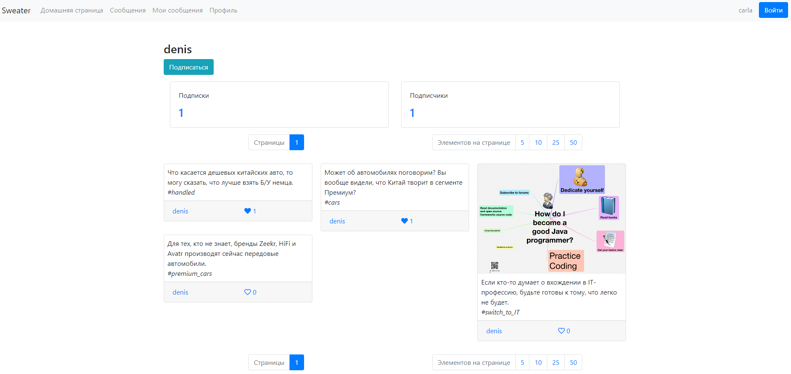

# Sweater

## Описание проекта
Проект представляет собой аналог Твиттера.
* Использование сервиса возможно только после регистрации и авторизации. 
* В системе есть пользователи и администраторы. Пользователи могут добавлять и редактировать сообщения, указывать 
хэштеги, прикреплять картинки, ставить лайки постам, подписываться на других пользователей и отменять подписку. 
* Пользователям доступен просмотр как всей ленты сообщений, так и ленты сообщений конкретных пользователей. 
* Администратор может просматривать статистику по пользователям сервиса, выдавать/отбирать права администратора.

## Стек технологий
* Java 17
* Apache Maven 3.8.5
* Docker Compose 3.9
* PostgreSQL 14
* Flyway 8.5.13
* Spring Boot 2.7.17
* Spring MVC 5.3.30
* Spring Data JPA 2.7.17
* Hibernate 5.6.15.Final
* Spring Security 5.7.11
* Freemarker 2.3.32
* Tomcat 9.0.82
* Lombok 1.18.30
* Checkstyle 9.0
* JaCoCo 0.8.11

## Требования к окружению
* Браузер
* Docker

## Инструкция по запуску проекта
1) Клонировать проект `git clone https://github.com/denfort50/sweater`
2) В файле `application.properties` указать параметры **spring.mail.host**, **spring.mail.port**, 
**spring.mail.username** и **spring.mail.password** для работы почтового сервера, а также указать **recaptcha.url** и
**recaptcha.secret** для работы капчи
2) Перейти в папку с проектом `cd sweater`
3) Запустить сборку и запуск контейнеров `docker-compose up`
4) Перейти на `localhost` в браузере

## Взаимодействие с приложением

### При открытии ресурса попадаем на страницу приветствия

### Необходимо авторизоваться

### Если учетной записи ещё нет, то регистрируемся

### После регистрации высылается письмо с кодом подтверждения

### Проходим по ссылке для активации пользователя

### Проходим авторизацию и попадаем на страницу с сообщениями

### В сервисе реализована пагинация

### Пагинация позволяет просматривать сообщения выборками, а не одним огромным списком

### Форма добавления нового поста

### Успешное добавление сообщения

### Страница постов текущего пользователя и его подписки с подписчиками

### Пользователь может посмотреть сообщения других пользователей и их подписки с подписчиками

### Можно "провалиться" к списку подписок / подписчиков

### А также перейти отсюда на страницу к другому пользователю

### Есть возможность изменять пароль и почту

### Администратор может просматривать список зарегистрированных пользователей

### Может изменить права пользователя

## Вариант дальнейшего развития проекта
1) Выделить frontend в отдельное приложение
2) Зарефакторить backend так, чтобы frontend получал данные в виде json-ответов, то есть реализовать RESTful API
3) Выделить логику авторизации и аутентификации в отдельный микросервис, взяв за основу OAuth2

## Контакты для связи
&nbsp;&nbsp;
&nbsp;&nbsp;